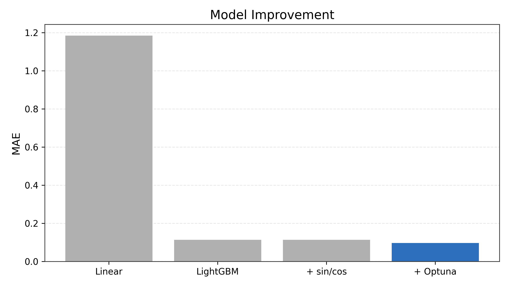
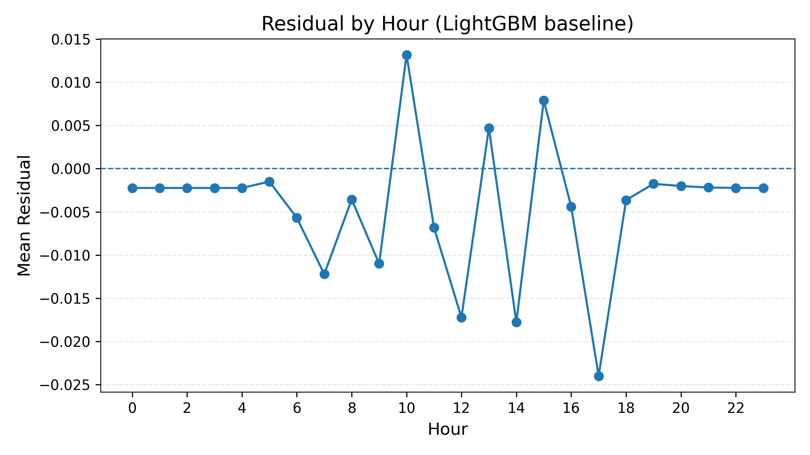
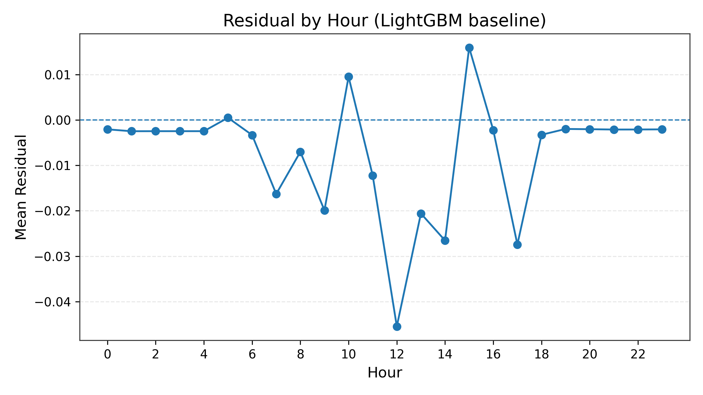
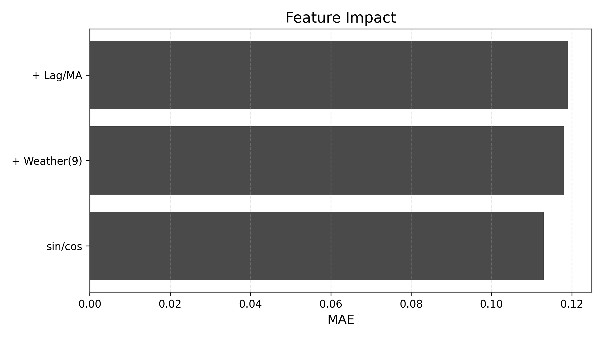
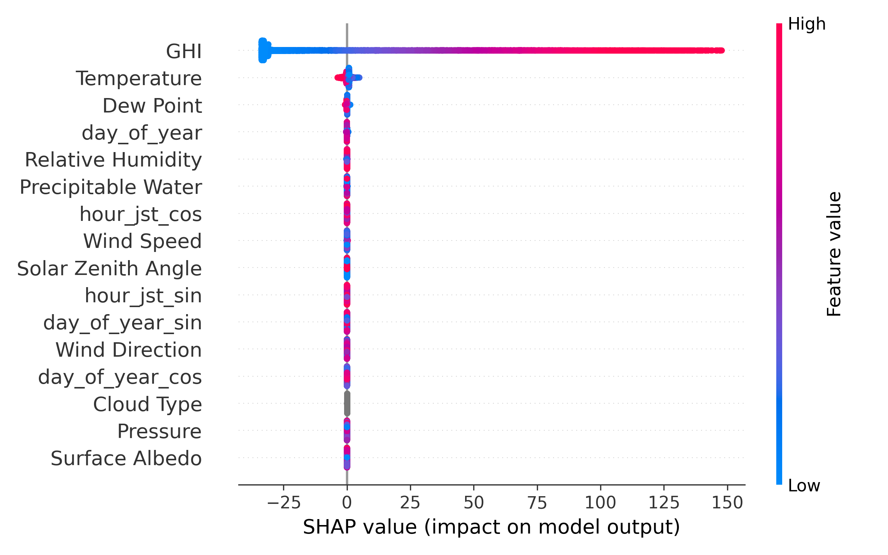
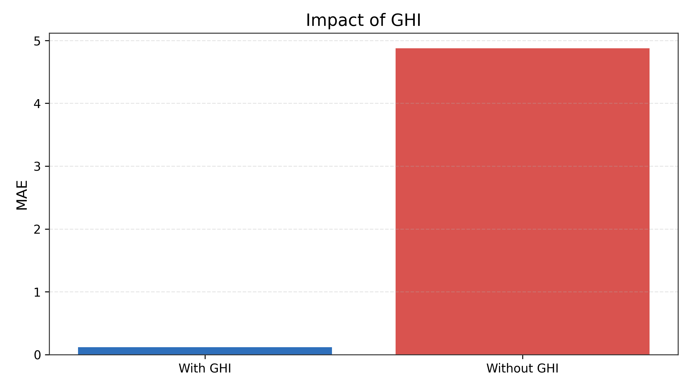
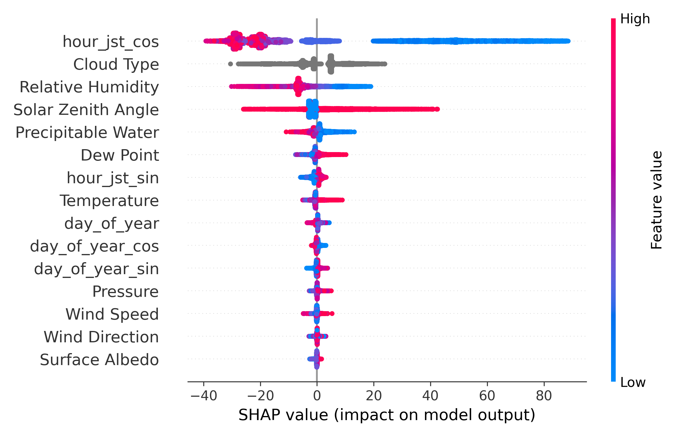

# 太陽光発電量の時系列予測

## ■ 概要

太陽光発電量の予測は、売電計画の立案や、発電効率改善などに用いられる。

そこで、本プロジェクトでは、気象データから太陽光発電量を予測をおこなう。
その際、特徴量設計・モデル改善・モデル解釈を通じて、    
**「なぜ当たるのか」を説明すること**を目的とした。

---

## ■ タスク定義

- 問題：回帰
- 目的変数：太陽光発電量（Wh/㎡）
- 粒度：1時間

※予測には公開気象データ(NSRDB: https://nsrdb.nlr.gov/)を利用する。  
※ただし、本物の発電所の発電量の実績値は基本的に一般公開されていないため、太陽光発電量についてはGHI（全天日射量）から生成した擬似データとする。  
※発電量予測の対象地は、山梨県庁とする。太陽光発電が盛んな山梨県の代表地点として選定した。


---

## ■ 前提（重要）

本タスクでは、発電量はGHIから生成されるため、  
**GHIが支配的な特徴量となる構造**を持つ。

---

## ■ 評価指標

本分析では**MAE**を主指標として採用した。

RMSEは大きな誤差の影響を強く受けるが、
太陽光発電における大きな誤差は天候の急変など、  
予測困難な要因による場合が多い。

そのため本分析では、
外れ値よりも**全体的な予測精度の向上**を重視し、MAEを採用した。

また、MAPEは0付近で不安定となるため、
夜間に発電量が0となる本タスクには適さないと判断し採用しなかった。

---

# ■ モデル改善の流れ



*図：モデル変更により大幅に精度が改善し、その後の特徴量追加の効果は限定的*

線形回帰からLightGBMへ変更することで、
非線形性を捉えられるようになり精度が大きく改善した。

---

# ■ 残差分析と周期特徴量

時間ごとの残差を分析した結果、
時間帯によって誤差の傾向に偏りがあることを確認した。



*図：LightGBM（baseline）の時間ごとの残差*

この結果から、周期性を考慮する目的で、
hourおよびday_of_yearをsin/cosで表現した。



*図：sin/cos導入後の時間ごとの残差*

導入後、精度（MAE）は下記であり、ほぼ変化しなかった。  
LightGBM（baseline）:0.113  
LightGBM(+sincos):0.113  

また、時間帯ごとの誤差のばらつきの軽減も起きなかった。  

以上より、周期特徴量の寄与は限定的であり、  
LightGBMが時間情報から周期性を内部的に学習している可能性が示唆された。

---

# ■ 特徴量追加の検証



*図：特徴量を追加しても精度改善は限定的、または悪化するケースが多い*

CloudTypeや複数の気象特徴量、履歴特徴量（ラグ・移動平均）を追加したが、
精度はほとんど改善せず、場合によっては悪化した。

これは、GHIがすでに発電量の情報をほぼ持っているため、
追加特徴量が新たな情報を提供できずに、ノイズとなるためと考えられる。

---

# ■ モデル解釈（SHAP）



*図：GHIが圧倒的に支配的な特徴量であることを確認*

SHAP分析により、GHIが発電量に対して圧倒的な寄与を持つことが確認された。
他の特徴量は補助的な役割に留まる。

＊GHIがリーク気味になっている可能性は否めないが、太陽光発電量予測において、  
日射量が重要な指標であるため、本分析ではGHIを特徴量として採用する。

---

# ■ GHI依存性の検証



*図：GHIを除外すると精度が大きく低下*

GHIを除外したモデルでは精度が大きく低下した。  



*図：GHIなしでは他特徴量が相対的に重要になる*

GHIを除外すると、他の気象特徴量が相対的に重要になるが、
精度は大きく低下する。

---

## ■ 考察

本タスクは以下の構造を持つことが示唆された：

- 発電量は主にGHIによって決定される
- 他特徴量は補助的に寄与
- GHIがない場合、代替的に他特徴量が働くが精度は低い

→ 本分析では、GHIから発電量を生成しているという前提はあるが、**「太陽光発電量はGHI（全天日射量）からに強く依存する問題」である**

---

# ■ ハイパーパラメータ最適化（Optuna）

特徴量設計後、最終的な改善としてOptunaを用いたパラメータチューニングを実施。

- MAE：0.113 → **0.097**

Best params:
num_leaves=119  
max_depth=8  
learning_rate=0.036  
n_estimators=861  
...  

改善は確認されたが、
性能の大部分は特徴量設計に依存していると考えられる。

---

# ■ まとめ

- モデル変更（線形回帰 → LightGBM）により、大幅に精度が改善した
- 周期特徴量の効果は限定的である（モデルが内部的に学習可能である可能性を示唆）
- 特徴量追加の効果は小さい
- SHAPによりモデルの挙動を解釈
- 当初は特徴量追加による改善を期待していたが、  
実際にはGHIがほぼ情報を持っており、追加特徴量の効果は限定的だった。


→ 本分析では、単なる予測精度の向上ではなく  
→ **「モデルが何に依存して予測しているか」を明らかにした**

---

# ■ 今後の課題

- 実測データでの検証
- 気象予報データを用いた予測

```plaintext
pv-forecasting/
├── README.md
├── config/
│   └── config.yaml
├── data/
│   ├── raw/
│   └── processed/sample.csv
├── notebooks/
│   ├── 01_eda.ipynb
│   ├── 02_baseline_model.ipynb
│   └── 03_feature_engineering_and_improvement.ipynb
├── src/
│   ├── 01_make_dataset.py
│   ├── 02_train.py
│   └── 03_predict.py
├── images/
│   ├── feature_comparison.png
│   ├── ghi_vs_no_ghi.png
│   ├── model_comparison.png
│   ├── residual_baseline.png
│   ├── residual_sin_cos.png
│   ├── shap_no_ghi.png
│   └── shap_with_ghi.png
├── output/
│   └── sample_prediction.csv
└── requirements.txt
```

## 実行環境

- Python 3.12
- MacBook Air (M2)