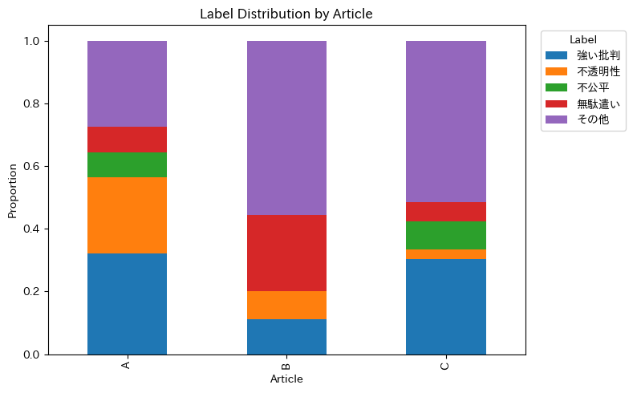
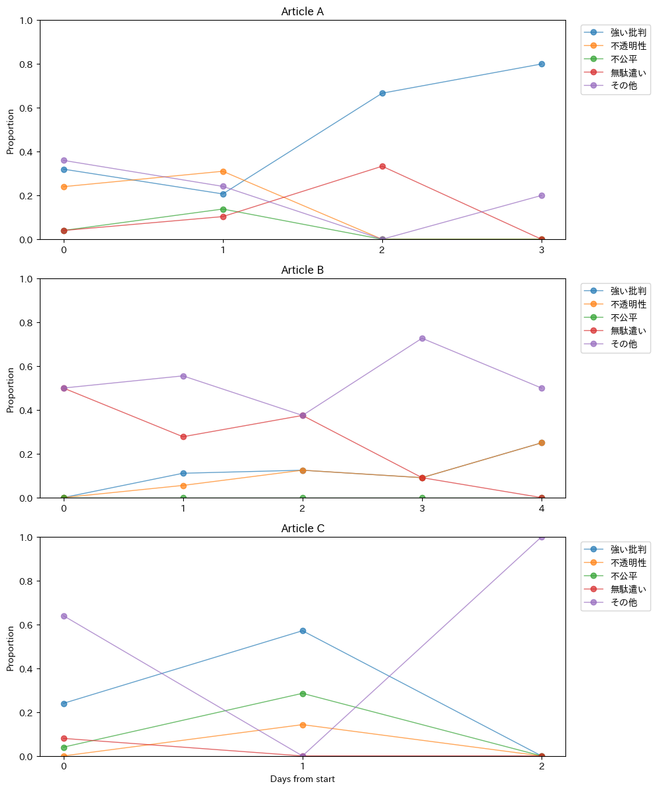

# sns-comment-analysis

## 概要

本分析は、SNSコメントをLLMで分類し、  
記事ごとのコメント傾向の時系列変化を分析したプロジェクトである。

太陽光発電量予測や天候分類では、
売電計画の補助や発電効率改善といった「攻め」の分析を扱った。  
一方で、組織運営においては、
炎上や reputational risk（評判リスク）のような
「守り」の観点も重要であると考えられる。

そこで本分析では、
SNSコメントの変化を時系列で観察し、
反応構造の違いを分析した。

今回、ニュースサイト上のユーザーコメントを対象に、

- 行政・税金への不満分類
- 感情傾向の推移
- 記事タイプごとの反応構造

を観察した。

本プロジェクトでは、  
「炎上しているか」を単純に判定するのではなく、

> コメントの性質が時間経過でどのように変化するか

に着目した。

**＊特定の政治思想や立場を分析することを目的としたものではなく、  
コメント数が比較的多く、幅広いユーザー反応を観察しやすい行政・公共政策系ニュースを対象として選定した。**

---

# 背景

SNS上では、行政・税金・公共政策に関するニュースに対して、  
短時間で大量の意見や感情が投稿される。

ただし、同じ「炎上」に見える記事でも、

- 感情的批判へ収束するケース
- 議論が複数論点へ分散するケース
- 一時的な反応で終わるケース

など、コメント構造は異なる可能性がある。

そこで本分析では、  
LLMを用いてコメントを分類し、  
記事ごとの反応変化を時系列で比較した。

---

# 使用技術

| 分類 | 技術 |
|---|---|
| 言語 | Python |
| データ処理 | pandas |
| 可視化 | matplotlib |
| LLM | Gemini API |
| データ | Yahooニュースコメント |

---

# データ概要

## 対象記事

3種類の記事を対象にコメントを収集した。

| 記事 | 想定特徴 |
|---|---|
| A | 強い炎上型 |
| B | 議論・意見分散型 |
| C | 比較的中立型 |

## コメント数

約140件

---

# 分類設計

LLMを用いて、各コメントを以下の5カテゴリへ分類した。  


| ラベル | 内容 |
|---|---|
| 無駄遣い | 税金の使い道への批判 |
| 不透明性 | 説明不足・制度不信 |
| 不公平 | 負担や恩恵の偏り |
| 強い批判 | 感情的・攻撃的反応 |
| その他 | 中立・軽微な意見 |

なお、プロンプト設計および分類基準の調整には、
X（旧Twitter）の投稿を用いた簡易検証を行った。  
特に「強い批判」ラベルについては、  
攻撃的な単語のみで分類されるケースが見られたため、

> 「感情表現が主軸となっている場合のみ強い批判とする」

という条件を追加し、
文全体の主旨を考慮するよう調整した。

---

# LLM分類

Gemini APIを利用し、  
複数コメントをCSV形式でバッチ入力して分類した。

LLMの出力安定性を優先し、  
JSONではなくCSV形式で返答する構成を採用した。

---

# 分析①：記事ごとのラベル分布

## ラベル分布比較



### 内容

記事A/B/Cごとのラベル割合を比較した積み上げ棒グラフである。

---

## 結果

### A記事
「強い批判」「不透明性」が多く、  
感情的反応と制度不信が混在していた。

### B記事
「その他」の割合が高く、  
強い炎上というより議論・意見交換型の反応が多かった。

### C記事
比較的中立記事として選定したが、  
想定より「強い批判」が多く検出された。
人の印象と、LLMの分類の違いの可能性を示唆した。

---

## 考察

C記事では、  
記事内容そのものへの批判というより、

- 教員全体への不信
- 制度全般への不満
- 感情的表現

へ話題が拡張しているコメントが見られた。

今回のプロンプトでは、

> 「感情が中心の場合は強い批判を優先」

と定義しており、  
LLMが感情表現を強く拾った可能性がある。

---

# 分析②：コメント傾向の時系列変化

## コメント推移



### 内容

記事投稿日を `Day0` とし、  
コメントラベル割合の推移を記事ごとに比較した。

横軸は投稿日からの日数、  
縦軸は各ラベルの割合を表している。

---

## 結果

### A記事
初期はラベルが分散していたが、  
時間経過とともに「強い批判」へ収束した。

特に後半では、  
感情的批判の割合が高くなった。

---

### B記事
初期は「無駄遣い」と「その他」が中心だったが、  
後半では「不透明性」「強い批判」など  
複数ラベルへ分散した。

議論型が複数論点へ広がる傾向が見られた。

---

### C記事
短期間で感情的反応が集中した後、  
「その他」のみへ移行した。

一時的な反応型の特徴が見られた。

---

# 考察

同じ行政系ニュースでも、

- 感情的批判へ収束する記事
- 論点が拡散する記事
- 一時的反応で終わる記事

など、実際にコメントを読んでみると、  
「炎上が集中する記事」と「議論が広がる記事」でかなり雰囲気が異なっていた。

実運用では、  
単純な炎上検知だけでなく、

> コメント傾向がどの方向へ変化しているか

を観察することで、

- 放置可能な議論型反応
- 追加説明や会見が必要なケース

を判断する補助情報として活用できる可能性がある。

---

# 人手ラベルとの比較（補助分析）

一部コメント（40件）について、  
人手によるラベリングも実施した。

人手分類では、  
感情的な単語や、印象に影響されやすい傾向があった。
一方で、LLMは文全体の構造や不満対象を考慮して    
分類する傾向が見られた。

ただし、  
人手ラベルは単独評価であり、  
評価者バイアスを含む可能性がある。

---

# 制約・課題

- コメント数が少なく、後半日程ではサンプル不足の影響を受ける可能性がある
- コメント取得数は記事ごとに一定の割合ではなく、コメント総数自体を分析指標には利用していない
- ラベル定義（特に「強い批判」）はプロンプト設計の影響を受けている可能性がある

---

# 今後の改善

- データ数の増加
- 人手ラベルの複数人化
- 感情強度推定
- プロンプトの改善

---

# フォルダ構成

```plaintext
sns-comment-analysis/
├── README.md
├── data/
│   ├── raw/
│   └── processed/
├── notebooks/
│   ├── 01_prompt.ipynb
│   ├── 02_batch.ipynb
│   └── 03_analysis.ipynb
├── src/
│   └── call_api_in_batches.py
├── images/
│   ├── article_label_distribution.png
│   └── comment_transition_timeseries.png
└── requirements.txt
```

## 実行環境

- Python 3.12
- MacBook Air (M2)