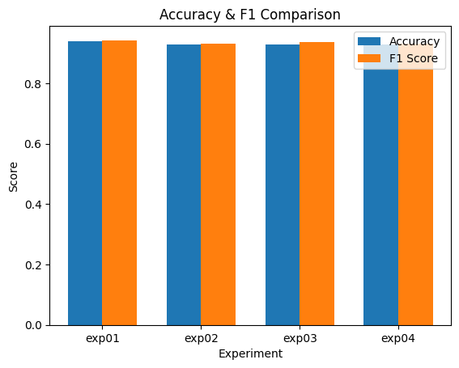
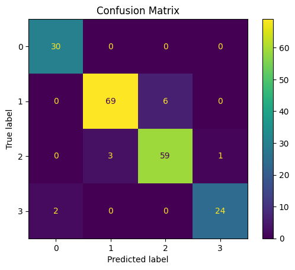
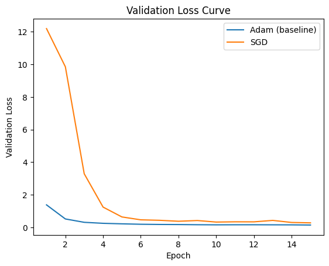

# Weather Image Classification for Solar Insight

## 1. 概要

本プロジェクトでは、天候画像を分類するモデルを構築し、  
太陽光発電における発電量変動の要因となる「天候状態」の判別を目的とする。

特に以下の観点に着目した：

* 軽量環境での画像分類
* モデル改善手法の効果検証
* データ品質とモデル性能の関係

---

## 2. タスク設定

### クラス

* sunny（高日射）
* cloudy（中日射）
* rain（低日射）
* snow（発電阻害）

---

## 3. 使用モデル

### EfficientNet-B0

本プロジェクトでは EfficientNet-B0 を採用した。

**採用理由：**

* パラメータ効率が高い（少ない計算量で高精度）
* 軽量環境（MacBook Air）でも実行可能
* 転移学習との相性が良い

---

## 4. データ

* 既存データセットから対象クラスを抽出
* クラスごとに分割し、train / val / test を作成
* testデータは全実験で共通化し、リーク防止

---

## 5. 実験設計

計算資源の制約を考慮し、以下の要素を**1つずつ変更**して影響を検証した：

* データ拡張の有無
* optimizerの違い（Adam / SGD）
* class weightの有無

---

## 6. 実験結果

| 実験ID  | Aug | Opt  | Weight | Accuracy  | F1        | 備考           |
| ----- | --- | ---- | ------ | --------- | --------- | ------------ |
| exp01 | ❌   | Adam | ❌      | **0.938** | **0.942** | baseline     |
| exp02 | ❌   | Adam | ⭕      | 0.928     | 0.930     | class weight |
| exp03 | ❌   | SGD  | ❌      | 0.928     | 0.935     | optimizer    |
| exp04 | ⭕   | Adam | ❌      | 0.928     | 0.930     | augmentation |

AccuracyおよびF1スコアの比較結果を以下に示す。



最終モデル（ベースライン）の混同行列は以下の通り。



### 実験結果の要約

- ベースラインモデルが最も高いAccuracyおよびF1を記録
- class weightおよびデータ拡張は性能改善に寄与しなかった
- SGDは学習途中の可能性があり、Adamの方が安定して収束

→ 本タスクではモデル構造や学習手法よりも、データ品質の影響が支配的であることが示唆された

---

## 7. 考察

### ① ベースラインが最も高性能

本データセットでは、クラスバランスおよびデータの多様性が既に確保されていたと考えられる。

そのため、追加の正則化（データ拡張）や補正（class weight）が
かえって性能低下につながった可能性がある。

---

### ② class weight

精度が低下したことから、クラス不均衡の影響が小さく、過補正となった可能性がある。

---

### ③ optimizer（Adam vs SGD）




SGDではval lossの変動が大きく、学習後半でも安定していないことから、
十分に収束していない可能性が確認された。

これは、SGDが一般に収束に時間を要する特性を持つためと考えられる。

一方、Adamは早期に収束しており、小規模データにおいて安定した学習が可能であると考えられる。

---

### ④ データ拡張

精度が低下したことから、既存データの多様性が十分であり、
拡張がノイズとして作用した可能性がある。

---

## 8. 制約と設計判断

* 計算資源：MacBook Air(M2チップ)
* エポック数：15

大規模なハイパーパラメータ探索は行わず、
**重要な要素に絞った比較実験**を実施した。

※MacBook Air環境での実験だったため、  
計算コストと実験回数のバランスを意識して設計した。

---

## 9. 結論

本プロジェクトの比較では、モデル改善よりも
**データの特性・品質が性能に与える影響が大きい**ことが示唆された。

---

## 10. 今後の展望

* 雪・雹など発電特性の近いクラスを再定義し、  
  データ量とラベル純度のバランスが性能に与える影響を検証する

* より大規模なデータセットを用いた追加検証を行い、  
  モデルの汎化性能を評価する

* Grad-CAM等を用いた可視化を行い、  
  モデルがどの領域を根拠に分類しているかを分析する

* ラベル品質やクラス定義を見直し、  
  データ設計の観点から性能改善を検討する

* 現在はEfficientNet-B0を特徴抽出器として利用しているが、  
  今後は後半層の一部を学習対象とし、  
  Conv層およびDropout層を追加することで、  
  天候画像に特化した特徴表現の獲得を検証する

* その際は、モデルの表現力向上と引き換えに  
  過学習リスクが高まる可能性があるため、  
  validation lossや汎化性能を確認しながら慎重に評価を行う

---

## 11. ディレクトリ構成

構成としては、詳細な検証をnotebook、  
再現可能な学習パイプラインは src 、と分離している。

```
image-classification/
├── notebooks/
│   ├── 01_eda.ipynb
│   ├── 02_baseline_model.ipynb
│   └── 03_model_comparison.ipynb
├── src/
├── config/
├── models/
├── images/
└── README.md
```

## 実行環境

- Python 3.12
- MacBook Air (M2)